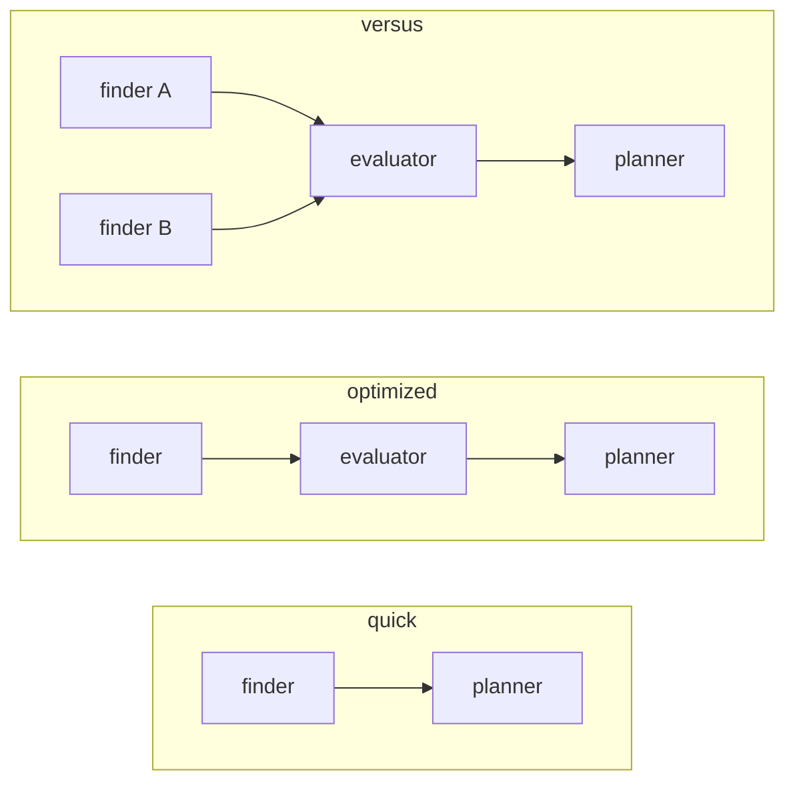
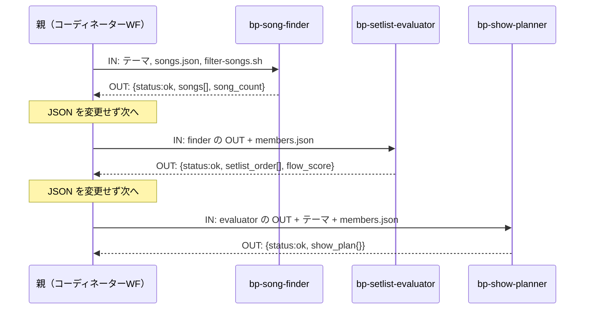

# CC/GHC クロスプラットフォーム エージェント設計

プラットフォーム非依存の **IN/OUT 契約**を核に据えれば、同じサブエージェント構成を Claude Code（CC）でも GitHub Copilot（GHC）でも再現できる。以下はその設計、移植仕様、再現性の検証方法である。BLACKPINK セットリスト・プランナーは、この設計を実証するための検証台として使う。

## 1. なぜサブエージェントに切り出すのか

単一のメインエージェントで複雑なタスクをこなすと、会話が進むほどコンテキストが肥大化し、トークン消費が膨らんで非効率になる。処理をサブエージェントに切り出すと、サブは隔離コンテキストで動いて中間出力を親に残さず、結果だけを返す。親の肥大を抑えたまま目的を達成できる。

狙いは、この切り出しを **CC・GHC の両方で再現性高く** 行う方法を確立すること（決定）。利用者層を広げるため、CC 専用に閉じず、同じ構成を GHC でも動かせることを要件に置く。

## 2. 構成要素は「親が読む手順書」で組む

CC・GHC の双方が備える機能だけで組み立てる、特定用途に依らない汎用構成である。実行主体は2つ。**親（メインエージェント）** が会話ループ本体、**サブエージェント** が隔離コンテキストで動く実行単位。どちらも手順書＝**ワークフロー（WF）** に従い、親側を**コーディネーターWF**、サブ側を**実行WF**と呼ぶ。


| 構成要素 | 役割 |
|---|---|
| コマンド | ユーザー入力を受け取る入口 |
| スキル | テーマを見て、使うコーディネーターWF を1つ選ぶ |
| コーディネーターWF | 全体を制御し、各処理をサブエージェントに委譲する手順書 |
| 実行WF | 委譲された単一責務を隔離実行し JSON を返す手順書。フロントマターでサブエージェントとして登録される |

コマンドとスキルは独立した実行者ではなく、親が読む構成要素にすぎない。

### 公式用語との対応

「WF」は公式用語ではなく、手順書ファイルを指す本設計の呼称。

| 概念 | CC 公式 | GHC 公式 | 本設計 |
|---|---|---|---|
| `/name` の入口 | skill（コマンドは skill に統合） | prompt file | コマンド |
| 能力パッケージ | skill | Agent Skill | スキル |
| 手順書 md | skill の supporting files | 同左 | WF |
| 隔離実行単位 | subagent | subagent | サブエージェント |

## 3. 動かせない4つのプラットフォーム制約

設計判断は、次の4つを前提に置く（いずれも各プラットフォームの仕様として確認済み。根拠は §10）。

1. **委譲は非決定的**。親がサブエージェントを起動するかは、WF 本文を LLM が解釈して Agent/runSubagent を呼ぶか次第で決まる。確実に呼ばせる保証構文は CC・GHC どちらにも無い。
2. **サブエージェントは隔離コンテキスト**。親のチャット履歴は見えず、親もサブの途中経過を見ない。データの仲介点は親だけ。
3. **受け渡しは全てプロンプト経由**。確定的な関数呼び出しではなく、LLM のプロンプト解釈に依存する。
4. **ネスト不可**。サブエージェントはさらにサブエージェントを呼べない。構成は親＞サブの1段フラットに限定される。

| ネスト | CC | GHC |
|---|---|---|
| 可否 | 不可（built-in 制約）。サブエージェントは Agent/Task ツールを持てない | 既定は不可。設定で有効化できるが深さ1が実用限界 |
| 根拠 | 「subagents cannot spawn other subagents」 | `chat.subagents.allowInvocationsFromSubagents` の項 |

### 3.1 実行ログ（transcript）の観測点

検証（§7）が前提とする、各プラットフォームの実行ログの構造。両プラットフォームとも **ファイル内の行順＝実行の時系列順**（タイムスタンプでの並べ替えは不要）。

#### ファイルの場所

| プラットフォーム | 主ログ | 補助ログ |
|---|---|---|
| CC | `~/.claude/projects/<slug>/<sessionId>.jsonl`。`<slug>` はリポジトリの絶対パスの `/` を `-` に置換したもの（例: `/home/u/work/bp` → `-home-u-work-bp`） | サブエージェント: `~/.claude/projects/<slug>/<sessionId>/subagents/agent-<hash>.jsonl` ＋同階層 `.meta.json` |
| GHC | `<VSCode User dir>/workspaceStorage/<wsHash>/GitHub.copilot-chat/transcripts/<sessionId>.jsonl`。`<wsHash>` は同階層 `workspaceStorage/<wsHash>/workspace.json` の `"folder"` フィールド（`vscode-remote://wsl%2B<distro>/<repoパス>` 形式）がリポジトリのパスと一致するディレクトリを探して特定する。`<VSCode User dir>` は WSL 経由なら `/mnt/c/Users/<user>/AppData/Roaming/Code/User`、Linux 側なら `~/.vscode-server/data/User` | ツール stdout: `GitHub.copilot-chat/chat-session-resources/<sessionId>/<toolCallId>__vscode-<ts>/content.txt` |

#### イベントのスキーマ

| 項目 | CC | GHC |
|---|---|---|
| イベント形式 | 1行1 JSON。`type`（`user`/`assistant`/`system` 等） | 1行1 JSON。`type`（`session.start`/`assistant.message`/`tool.execution_start`/`tool.execution_complete`/`assistant.turn_start`/`assistant.turn_end`/`user.message` 等） |
| 親のツール呼び出し | `type=assistant` の `message.content[]` 内、`type=tool_use` の要素。`name`＝ツール種別（`Read`/`Bash`/`Agent` 等）、`id`＝呼び出しID、`input`＝引数 | `type=assistant.message` の `data.toolRequests[]`（`name`, `toolCallId`, `arguments`）と、対応する `type=tool.execution_start`（`data.toolName`, `data.toolCallId`, `data.arguments`）。同一呼び出しが両方に出るため `toolCallId` で重複排除する |
| ツール結果（stdout 等） | `type=user` の `message.content[]` 内、`type=tool_result` の要素。`tool_use_id` が呼び出し側の `id` と一致し1:1対応 | `type=tool.execution_complete`（`data.toolCallId`, `data.success`）。**stdout 自体は含まれない**。stdout は上表の `content.txt` から読む |
| サブエージェント委譲の記録場所 | **別ファイル**: `<sessionId>/subagents/agent-<hash>.jsonl` に完全な内部トレースが記録される（CC 本体と同じスキーマ）。`.meta.json` の `toolUseId` が親側 `Agent` tool_use の `id` と一致し1:1対応する。親ファイル自体にはサブエージェント内部の中間ステップは現れない（`isSidechain` は常に `false`） | **同一ファイルにフラット記録**: サブエージェント内部の全イベントが、`runSubagent` の `tool.execution_start` と、同じ `toolCallId` を持つ `tool.execution_complete` の間に、他の親イベントと区別なく時系列で並ぶ |
| コマンド引数（テーマ）の記録 | `<command-args>` を含むテキストブロックに残るが、`/clear` 直後の空ブロック等と誤認しやすく脆弱 | 記録されない（GHC はエントリコマンド自体をログに残さない） |
| 最終応答の記録 | 記録される | **セッション最後の応答ターンのみ記録されない**（obs.limit）。`runSubagent` に委譲されたステップの OUT はこの制約を受けない |

CC の `Bash` を `run_in_background: true` で呼ぶと `tool_result` がプレースホルダになり stdout が別の揮発ファイルに逃げるため、計測対象のツール呼び出しは常にフォアグラウンド実行する（WF・エージェント定義側で明示するか、既定値に任せる）。

## 4. 制約から導く6つの設計原則

非決定な委譲とプロンプト経由の受け渡しという制約は、委譲確度と再現性を最大化する次の決定を導く。

1. **名指しで委譲する**。「適切なエージェントに任せて」ではなくサブエージェント名を明示する。委譲確度の最大の鍵は、この名前とエージェント側 `description` の語彙一致。
2. **IN は全てプロンプトに同梱する**。サブは親の履歴を見ないため、パスも上限値も渡す。
3. **OUT は JSON のみ・語彙を固定する**。前置き・説明・markdown を付けず、フィールド名を固定して機械判定できる形にする（§7.3 の BPTRACE 行は OUT の一部ではなく、JSON の直後に続ける検証用の別行として扱う）。
4. **親仲介を強制する**。サブ同士は直接通信できないため、OUT を次の IN へ渡すのは必ず親。WF に「JSON を変更せず次へ渡す」と明記する。
5. **IN/OUT 契約はプラットフォーム間で不変に保つ**。CC→GHC で変えるのは呼び出し文言・パス・フロントマターだけ。契約を触ると「プラットフォーム差」と「仕様変更」が混ざり、原因を切り分けられなくなる。
6. **段階的にビルドアップする**。一度に組まず、1変数ずつ増やして各段で再現性を確認する。

### 共通エラーフォーマット

全サブエージェント共通のエラー JSON。

```json
{ "status": "error", "agent": "<サブエージェント名>", "message": "<詳細>" }
```

## 5. 実装テンプレート — 委譲は2ファイルの組

委譲は **① 呼ぶ側（コーディネーターWF の Step）** と **② 呼ばれる側（エージェント定義）** の組で成立する。`<...>` が穴埋め箇所。

### ① 呼ぶ側（WF Step）

**CC**:
```markdown
## Step <N> — <ステップ名>
IN: <このステップの入力>
（Step 1 かつ WF 冒頭なら、この直前に BPTRACE start theme="<theme>" wf=<このWFファイル名> を1回出す）
Use the agent tool to invoke the `<subagent-name>` subagent with the following prompt:

---
<key1>: <value1>
<key2>: <path-or-value>
---

Wait for the subagent to return a JSON object.
If the result contains `"status": "error"`, show the message and stop.
Do not modify the result. Pass the full JSON object unchanged to <次の Step>.
OUT: the JSON object from the `<subagent-name>` subagent (unchanged).
（サブエージェントに委譲した Step の場合、BPTRACE step=<N> out actor=<subagent-name> はサブエージェント自身が出す。委譲しない Step は、この OUT 直後に親が BPTRACE step=<N> out actor=main を出す）
```

**GHC**（差分は呼び出し文言とリソースパスのみ。IN/OUT・BPTRACE 行は不変）:
```markdown
Run the `<subagent-name>` subagent (runSubagent) with the following prompt:
（IN ブロック以下は同一。リソースパスは .github/ に。BPTRACE 行の位置・書式は CC と同一）
```

### ② 呼ばれる側（エージェント定義）

**CC**（`.claude/agents/<subagent-name>.md`）:
```markdown
---
name: <subagent-name>
description: <動詞で始まる1行。呼ぶ側の依頼文と語彙を重ねる>
tools: <必要最小限>
---
## IN
- <呼ぶ側が渡すキーを列挙>
- step_no — このサブエージェントが担当する WF の Step 番号（呼ぶ側が渡す）

## Procedure
1. <手順>
2. 下の OUT の JSON を返す直後に、`BPTRACE step=<step_no> out actor=<subagent-name>` を1行だけ出す（前置き・markdown を付けない）

## OUT（成功）
{ "status":"ok", <固定フィールド...> }
BPTRACE step=<step_no> out actor=<subagent-name>
## OUT（エラー）
{ "status":"error", "agent":"<subagent-name>", "message":"<詳細>" }
```

**GHC**（`.github/agents/<subagent-name>.agent.md`。フロントマターのみ変換、本文は同一）:
```yaml
---
name: <subagent-name>
description: <CC と同一>
tools: [<ツール名を GHC 名に変換>]
model: <GHC モデル名>
target: vscode
---
```

## 6. CC ↔ GHC 移植仕様（参照）

> 最終確認日: 2026-05-25

移植で変えるのはファイル配置・フロントマター・本文の呼び出し文言・ツール名・モデル名だけ。IN/OUT 契約は §4-5 のまま触らない。

### 6.1 ファイル配置

| 構成要素 | CC | GHC |
|---|---|---|
| コマンド | `.claude/commands/<name>.md` | `.github/prompts/<name>.prompt.md` |
| スキル | `.claude/skills/<name>/SKILL.md` | `.github/skills/<name>/SKILL.md` |
| WF | `.claude/skills/<name>/workflows/*.md` | `.github/skills/<name>/workflows/*.md` |
| リソース | `.claude/skills/<name>/resources/*` | `.github/skills/<name>/resources/*` |
| エージェント定義 | `.claude/agents/<name>.md` | `.github/agents/<name>.agent.md` |

CC ではコマンドとスキルが統合済みで、`.claude/commands/<name>.md` と `.claude/skills/<name>/SKILL.md` は同じスラッシュコマンドを作り同じ挙動になる。CC 単体ならコマンドは省ける。一方 GHC は入口の prompt file と能力の skill が別建て。本設計が CC でも薄いコマンド層を残すのは、GHC と構造を対称に保つため（決定）。

GHC は `.claude/` 配下も直接読める（Claude フォーマット互換）が、本設計は GHC ネイティブ形式へ変換する。

### 6.2 フロントマター変換

**エントリポイント**

| CC | GHC | 備考 |
|---|---|---|
| `description` | `description` | そのまま |
| `command: /name` | （不要） | GHC はファイル名がコマンド名 |
| `allowed-tools` | `tools: [...]` | 配列化＋ツール名変換 |
| （なし） | `agent: agent` | GHC フィールドを追加 |
| `model` | `model` | モデル名変換 |

**スキル（SKILL.md）**

| CC | GHC | 備考 |
|---|---|---|
| `name` / `description` / `argument-hint` | 同名 | そのまま |
| `disable-model-invocation` / `user-invocable` | 同名 | そのまま |
| `allowed-tools` | `tools: [...]` | フィールド名変更＋ツール名変換 |
| `model` | `model` | モデル名変換 |
| `context: fork` | `context: fork` | GHC 側は Experimental |

本文中のパス参照は変換する（`.claude/skills/` → `.github/skills/`）。WF・リソースはパス参照の変換のみ。

**エージェント定義（サブエージェント）**

| CC | GHC | 備考 |
|---|---|---|
| `name` / `description` | 同名 | そのまま |
| `tools: Read, Grep` | `tools: ['readFile', 'search/codebase']` | ツール名変換 |
| `model: sonnet` | `model: Claude Sonnet 4.6 (copilot)` | モデル名変換 |
| `disallowedTools` / `permissionMode` / `maxTurns` / `memory` / `skills` | （削除） | GHC に対応なし |
| `hooks` | `hooks` | GHC も Preview 対応。形式差の有無は未確認 |
| （なし） | `target: vscode` | GHC フィールドを追加 |
| （なし） | `agents: [...]` | GHC 固有。サブ呼び出し制限（省略で無制限） |

### 6.3 本文の変換

| 項目 | CC | GHC |
|---|---|---|
| サブエージェント呼び出し | `Use the agent tool to invoke the <name> subagent` | `<name> をサブエージェントとして起動`（runSubagent） |
| リソースパス | `.claude/skills/<name>/...` | `.github/skills/<name>/...` |
| 引数 | `$ARGUMENTS` / `$N` / `$name` | 下記 |
| BPTRACE マーカー行（§7.3） | 不変（そのまま） | 不変（そのまま） |

GHC の引数機構は宣言的ではない。エントリポイントは `$ARGUMENTS` を含む行を削除し、ユーザー入力が末尾に自動付与される前提で調整する（位置引数は `${input:name}`）。スキル・WF はテンプレート変数に対応しないため、自然言語の指示に書き換える。

### 6.4 ツール名

| CC | GHC | 備考 |
|---|---|---|
| `Read` | `readFile` | |
| `Grep` / `Glob` | `search/codebase` | 同一ツールに集約 |
| `Write` | `createFile` | |
| `Edit` | `editFiles` | |
| `Bash` | `runInTerminal` | |
| `Agent` | `agent/runSubagent` | |

GHC はツールセット（`search`, `read`, `edit`, `execute`, `agent`）と個別ツールを混在指定できる。UI 経由で設定するとツール名が壊れる既知バグがあるため、手動記述を推奨（microsoft/vscode-copilot-release#14104）。

### 6.5 モデル名

| CC | GHC |
|---|---|
| `haiku` | `Claude Haiku 4.5 (copilot)` |
| `sonnet` | `Claude Sonnet 4.6 (copilot)` |
| `opus` | `Claude Opus 4.6 (copilot)` |
| `inherit` | （フィールド省略） |

GHC の `model` は配列も受け付ける（優先順フォールバック）。

### 6.6 GHC 前提設定

サブエージェントからの再呼び出しを使う場合のみ必要（本設計の1段委譲では不要）。

```json
{ "chat.subagents.allowInvocationsFromSubagents": true }
```

### 6.7 変換スクリプト

マッピングを YAML/JSON のルールファイルに定義し、Python/bash で機械変換する。仕様変更時はルールファイルだけを更新する。

## 7. 再現性は段階的ビルドアップで検証する

### 7.1 1変数ずつ積む

一度に組むと、壊れた要素を1変数に絞れない。次の順で積む。

1. **stage-A: サブエージェント無し** — 親が全ステップを実行。ルーティング・Step 順・スクリプト実行・OUT 形を安定させ、`verify-run.py --stage a` で PASS させる。
2. **stage-B: 1ステップだけサブ化** — 最初の1つを切り出し、WF Step を委譲形式に。`--stage b` で委譲発生を確認する。
3. **CC PASS → GHC 変換 → GHC 再測定** — 変換スクリプトで GHC を再生成し、同等モデル・コールドセッションで測定する。
4. **1変数ずつ増やす** — 2つ目以降も同手順。各段で前段の PASS を壊さない。

測定はユーザー操作のコールドセッションで行う。開発セッション内で起動すると文脈が混ざるため使わない。

### 7.2 不変条件（layer-2）

| 条件 | 内容 |
|---|---|
| C1 | スキルが WF を選択して実行する |
| C2 | filter スクリプトの実行が transcript に記録される |
| C3 | filter スクリプトが実際に実行される |
| C4 | 各 Step の OUT 形式が揃っている |
| C5 | 委譲の有無（stage-A: 0、stage-B: ≥1） |

`verify-run.py` が transcript を解析して C1–C5 を機械判定する。`--latest N` で直近ランを自動検索できる。

### 7.3 検証方式: 実行順マーカー

判定根拠は次の2種類だけに限る。自然文の語彙、WF・リソースファイル自身の記述内容は判定対象にしない（§3.1 の観測点を前提とする）。

1. **構造化フィールドから確実に取れるツール呼び出し**（Read/Bash/Agent/runSubagent 等の `name`/`toolName` フィールド）— 既に一意に判別できるため、マーカーを追加しない
2. **WF 自身が echo する一意マーカー**（下記）— ツール呼び出しでは判別できない「Step の OUT が確定した瞬間」を示すためだけに使う

#### マーカー形式

固定トークン `BPTRACE` を先頭に持つ1行。自然文・データファイルに出現する可能性を実質ゼロにする。

```
BPTRACE start theme="<テーマ原文>" wf=<workflow-file>
BPTRACE step=<n> out actor=<main|サブエージェント名>
```

- `start`: WF 本文が Step 1 に入る前、最初の行として1回だけ出す。`theme` はユーザー入力そのまま、`wf` は今読んでいる WF ファイル名（例: `optimized.md`）
- `step=<n> out`: 各 Step の OUT を書き終えた直後に、その Step を実行した主体を添えて出す。主体がサブエージェントなら、そのサブエージェントの OUT の最後にサブエージェント自身が出す（親ではない）
- 検索場所: モデルが出力したプレーンテキストの中に現れる。CC は `type=text` の content block、GHC は `assistant.message` の `content` 文字列（§3.1）

WF ごとの配置（`optimized.md` の例。`quick.md`/`versus.md` も同じ規則で Step 数・IN/OUT 契約に合わせて配置する）:

```
## Step 1 — Find songs
（WF 冒頭、Step 1 の処理に入る前）
BPTRACE start theme="<theme>" wf=optimized.md
...
（bp-song-finder に委譲する場合、bp-song-finder 自身が OUT の JSON の直後に）
BPTRACE step=1 out actor=bp-song-finder
（委譲しない場合、親が Step 1 の OUT の直後に）
BPTRACE step=1 out actor=main

## Step 2 — Order the setlist
...
BPTRACE step=2 out actor=main

## Step 3 — Write the show plan
...
BPTRACE step=3 out actor=main
```

#### 抽出と突き合わせ

1. **対象ファイルの特定**: `BPTRACE start theme="<テーマ>"` を含むファイルを検索する（CC: `<projDir>/*.jsonl`、GHC: `transcripts/*.jsonl`）。渡されたテーマ文字列と完全一致する行を持つ最新のファイルを採用する
2. **イベント列の抽出**: 対象ファイル（CC はサブエージェント委譲があれば `<sessionId>/subagents/*.jsonl` も、GHC は `runSubagent` の `tool.execution_start`〜`tool.execution_complete` 区間も含めて）を時系列にスキャンし、(a) 種別が判別できるツール呼び出しと (b) `BPTRACE` 行を、出現順に1本の実測イベント列にする
3. **期待列との比較**: ステージ（A/B）と WF ごとに定義した期待イベント列（例: stage-B optimized.md = `read(optimized.md) → delegate(bp-song-finder) → bp-song-finder内のBash(filter-songs.sh) → step1 out actor=bp-song-finder → step2 out actor=main → step3 out actor=main`）に対し、実測列が同じ順序で全項目を含むかを見る

#### C1–C5 との対応

| 条件 | 判定方法 |
|---|---|
| C1（WF 選択） | `BPTRACE start` の `wf=` と、テーマから期待される WF 名の一致 |
| C2（filter 実行の記録） | 実測イベント列に `Bash`/`run_in_terminal`（filter-songs.sh）が含まれるか |
| C3（filter 実際の実行） | 上記ツール呼び出しの tool_result／付随ログで判定（既存方式を踏襲） |
| C4（Step OUT 形式） | `BPTRACE step=<n> out` が全 Step 分、`actor` 込みで出ているか |
| C5（委譲の有無） | `Agent`/`runSubagent` 呼び出し件数（stage-A: 0、stage-B: ≥1）と、`actor=` の値が委譲先サブエージェント名と一致するか |

## 8. 検証台: BLACKPINK セットリスト・プランナー

ユーザーがテーマを伝えると、楽曲を検索し、セットリストの流れを評価し、演出プランを生成する。設計を実証するための最小サンプル。

### 8.1 ディレクトリ構成（CC）

```
.claude/
├── commands/bp.md                       ← /bp <テーマ>
├── skills/blackpink/
│   ├── SKILL.md                         ← WF 振り分け
│   ├── workflows/{quick,optimized,versus}.md
│   └── resources/{songs.json,members.json,filter-songs.sh}
└── agents/{bp-song-finder,bp-setlist-evaluator,bp-show-planner}.md
```

### 8.2 データフロー

WF は3種。ステップ数と委譲の並列度が異なる。



### 8.3 JSON 受け渡し（optimized）

親が各サブの OUT を変更せず次の IN に渡す（原則4）様子を示す。



### 8.4 finder の実体（2ファイルの組）

呼ぶ側（`optimized.md` Step 1）:
```markdown
## Step 1 — Find songs
IN: the user's theme.
BPTRACE start theme="<theme>" wf=optimized.md
Use the agent tool to invoke the `bp-song-finder` subagent with the following prompt:

---
theme: <theme>
songs_json: .claude/skills/blackpink/resources/songs.json
filter_sh: .claude/skills/blackpink/resources/filter-songs.sh
max_songs: 12
step_no: 1
---

Wait for the subagent to return a JSON object.
Do not modify the result. Pass the full JSON object unchanged to Step 2.
OUT: the JSON object from the bp-song-finder subagent (unchanged).
```

呼ばれる側（`bp-song-finder.md`）:
```markdown
---
name: bp-song-finder
description: Run filter-songs.sh for each matching mood tag, collect and
  deduplicate results, return a JSON object of candidate songs
tools: Bash, Read
---
## IN
- theme / songs_json / filter_sh / max_songs / step_no

## Procedure
1. theme を mood タグ群に対応づける（利用可能タグ38種）
2. 各タグで `bash <filter_sh> <songs_json> mood <tag>` を実行
3. id で重複排除し max_songs 件まで保持
4. 下の OUT の JSON を返し、直後に BPTRACE 行を1行だけ出す

## OUT（成功）
{ "status":"ok", "theme_input":"...", "song_count":<int>,
  "songs":[ {id,title,bpm,energy,mood[],duration_sec,
             members_featured[],has_dance_break,suitable_for[]} ] }
BPTRACE step=1 out actor=bp-song-finder
## OUT（エラー）
{ "status":"error", "agent":"bp-song-finder", "message":"<詳細>" }
```

## 9. 現状

モデル: CC・GHC ともに Sonnet 4.6。

| 項目 | 状態 |
|---|---|
| stage-A（サブエージェント無し）実装 | CC・GHC とも3 WF（optimized/quick/versus）実装済み |
| stage-B（finder 委譲）実装 | CC: `bp-song-finder` + `optimized.md` Step1 実装済み。GHC: 変換スクリプトで生成済み |
| `verify-run.py`（マーカー方式） | 未実装。現行は自然文キーワード検索方式で、§7.3 の設計に置き換え予定 |
| stage-A / stage-B の C1–C5 測定 | マーカー方式実装後に再測定する（旧チェッカーでの測定結果は判定根拠として採用しない） |

**残るプラットフォーム制約**: GHC の obs.limit（§3.1）。構造的で、プロンプトでは解消できない。

## 10. 情報源

| 項目 | URL |
|---|---|
| CC サブエージェント | https://code.claude.com/docs/en/sub-agents |
| CC スキル | https://code.claude.com/docs/en/skills |
| CC スラッシュコマンド | https://code.claude.com/docs/en/agent-sdk/slash-commands |
| GHC サブエージェント | https://code.visualstudio.com/docs/copilot/agents/subagents |
| GHC カスタムエージェント | https://code.visualstudio.com/docs/copilot/customization/custom-agents |
| GHC プロンプトファイル | https://code.visualstudio.com/docs/copilot/customization/prompt-files |
| GHC エージェントスキル | https://code.visualstudio.com/docs/copilot/customization/agent-skills |
| GHC エージェントツール | https://code.visualstudio.com/docs/copilot/agents/agent-tools |
| GHC ツール名バグ | https://github.com/microsoft/vscode-copilot-release/issues/14104 |
