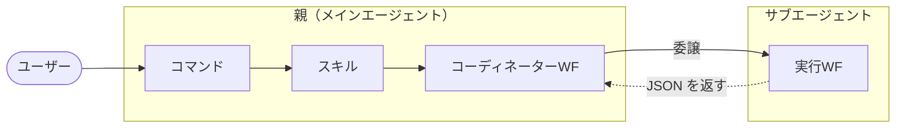
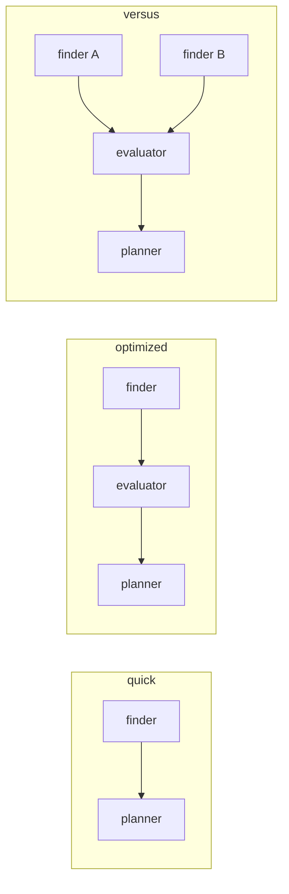
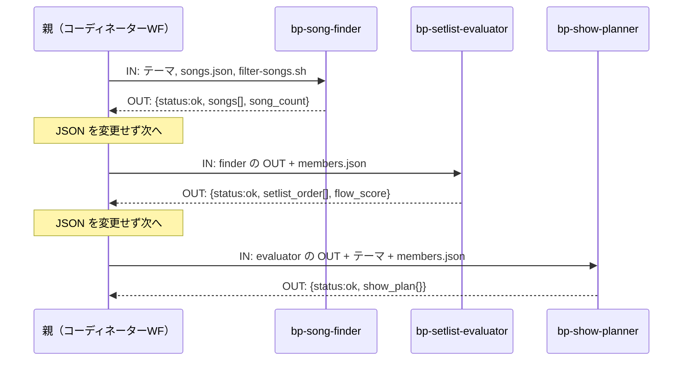

# CC/GHC クロスプラットフォーム エージェント設計

## 1. 目的と課題

**課題**: 単一のメインエージェントで複雑なタスクをこなすと、会話が進むほどコンテキストが肥大化し、トークン消費が膨らんで非効率になる。

**解決策**: 処理をサブエージェントに切り出す。サブエージェントは隔離コンテキストで動き、中間出力を親に残さず結果だけを返す。メインの肥大を抑えつつ目的を達成する。

**ゴール**: CC・GHC の両方でサブエージェント活用を**再現性高く**行う方法を確立する。利用者層を広げるため、CC だけでなく GHC でも同じ構成を動かせるようにする。BLACKPINK プランナーは方法を実証する検証用サンプル。


## 2. 構成要素と用語

CC・GHC の双方が備える機能で組み立てる、特定用途に依らない汎用構成である。実行主体は2つ。**親（メインエージェント）**が会話ループ本体、**サブエージェント**が隔離コンテキストで動く実行単位。どちらも手順書＝**ワークフロー（WF）**に従う。親側を**コーディネーターWF**、サブ側を**実行WF**と呼ぶ。



| 構成要素 | 役割 |
|---|---|
| コマンド | ユーザー入力を受け取る入口 |
| スキル | テーマを見て、使うコーディネーターWF を1つ選ぶ |
| コーディネーターWF | 全体を制御し、各処理をサブエージェントに委譲する手順書 |
| 実行WF | 委譲された単一責務を隔離実行し JSON を返す手順書。フロントマターでサブエージェントとして登録される |

コマンド・スキルは独立した実行者ではなく、親が読む構成要素である。

### 公式用語との対応

「WF」は公式用語ではなく、手順書ファイルを指す本設計の呼称。

| 概念 | CC 公式 | GHC 公式 | 本設計 |
|---|---|---|---|
| `/name` の入口 | skill（コマンドは skill に統合） | prompt file | コマンド |
| 能力パッケージ | skill | Agent Skill | スキル |
| 手順書 md | skill の supporting files | 同左 | WF |
| 隔離実行単位 | subagent | subagent | サブエージェント |


## 3. プラットフォーム制約

設計判断の前提となる、動かせない条件。

1. **委譲は非決定的**。親がサブエージェントを起動するかは、WF 本文を LLM が解釈して Agent/runSubagent を呼ぶかで決まる。確実に呼ばせる保証構文は CC・GHC どちらにも無い。
2. **サブエージェントは隔離コンテキスト**。親のチャット履歴は見えず、親もサブの途中経過を見ない。データは親が唯一の仲介点。
3. **受け渡しは全てプロンプト経由**。確定的な関数呼び出しではなく、LLM のプロンプト解釈に依存する。
4. **ネスト不可**。サブエージェントはさらにサブエージェントを呼べない。構成は親＞サブの1段フラットに限定される。

| ネスト | CC | GHC |
|---|---|---|
| 可否 | 不可（built-in 制約）。サブエージェントは Agent/Task ツールを持てない | 既定は不可。設定で有効化は可能だが深さ1が実用限界 |
| 根拠 | 「subagents cannot spawn other subagents」 | `chat.subagents.allowInvocationsFromSubagents` の項 |


## 4. 設計原則

制約から導く、プラットフォーム非依存の決定。

1. **名指しで委譲する**。「適切なエージェントに任せて」ではなくサブエージェント名を明示する。委譲確度の最大の鍵は、この名前とエージェント側 `description` の語彙一致。
2. **IN は全てプロンプトに同梱する**。サブエージェントは親の履歴を見ないため、パス・上限値まで渡す。
3. **OUT は JSON のみ・語彙を固定する**。前置き・説明・markdown を付けない。フィールド名を固定し、機械判定できるようにする。
4. **親仲介を強制する**。サブ同士は直接通信できないため、OUT を次の IN に渡すのは必ず親。WF に「JSON を変更せず次へ渡す」と書く。
5. **IN/OUT 契約はプラットフォーム間で不変に保つ**。CC→GHC で変えるのは呼び出し文言・パス・フロントマターのみ。契約を触ると「プラットフォーム差」と「仕様変更」が混ざり、原因を切り分けられなくなる。
6. **段階的にビルドアップする**。一度に組まず、1変数ずつ増やして各段で再現性を確認する。

### 共通エラーフォーマット

全サブエージェント共通のエラー JSON。

```json
{ "status": "error", "agent": "<サブエージェント名>", "message": "<詳細>" }
```


## 5. 実装テンプレート

委譲は**2ファイルの組**で成立する。**① 呼ぶ側（コーディネーターWF の Step）**と **② 呼ばれる側（エージェント定義）**。`<...>` が穴埋め箇所。

### ① 呼ぶ側（WF Step）

**CC**:
```markdown
## Step <N> — <ステップ名>
IN: <このステップの入力>
Use the agent tool to invoke the `<subagent-name>` subagent with the following prompt:

---
<key1>: <value1>
<key2>: <path-or-value>
---

Wait for the subagent to return a JSON object.
If the result contains `"status": "error"`, show the message and stop.
Do not modify the result. Pass the full JSON object unchanged to <次の Step>.
OUT: the JSON object from the `<subagent-name>` subagent (unchanged).
```

**GHC**（CC との差分は呼び出し文言とリソースパスのみ。IN/OUT は不変）:
```markdown
Run the `<subagent-name>` subagent (runSubagent) with the following prompt:
（IN ブロック以下は同一。リソースパスは .github/ に）
```

### ② 呼ばれる側（エージェント定義）

**CC**（`.claude/agents/<subagent-name>.md`）:
```markdown
---
name: <subagent-name>
description: <動詞で始まる1行。呼ぶ側の依頼文と語彙を重ねる>
tools: <必要最小限>
---
## IN
- <呼ぶ側が渡すキーを列挙>

## Procedure
1. <手順>
2. 下の OUT の JSON だけを返す（前置き・markdown を付けない）

## OUT（成功）
{ "status":"ok", <固定フィールド...> }
## OUT（エラー）
{ "status":"error", "agent":"<subagent-name>", "message":"<詳細>" }
```

**GHC**（`.github/agents/<subagent-name>.agent.md`。フロントマターのみ変換、本文は同一）:
```yaml
---
name: <subagent-name>
description: <CC と同一>
tools: [<ツール名を GHC 名に変換>]
model: <GHC モデル名>
target: vscode
---
```


## 6. CC ↔ GHC 移植仕様

> 最終確認日: 2026-05-25

### 6.1 ファイル配置

| 構成要素 | CC | GHC |
|---|---|---|
| コマンド | `.claude/commands/<name>.md` | `.github/prompts/<name>.prompt.md` |
| スキル | `.claude/skills/<name>/SKILL.md` | `.github/skills/<name>/SKILL.md` |
| WF | `.claude/skills/<name>/workflows/*.md` | `.github/skills/<name>/workflows/*.md` |
| リソース | `.claude/skills/<name>/resources/*` | `.github/skills/<name>/resources/*` |
| エージェント定義 | `.claude/agents/<name>.md` | `.github/agents/<name>.agent.md` |

CC ではコマンドとスキルが統合済みで、`.claude/commands/<name>.md` と `.claude/skills/<name>/SKILL.md` は同じスラッシュコマンドを作り同じ挙動になる。CC 単体ならコマンドは省ける。GHC は入口の prompt file と能力の skill が別建て。本設計が CC でも薄いコマンド層を残すのは、GHC と構造を対称に保つため。

GHC は `.claude/` 配下も直接読める（Claude フォーマット互換）が、本設計は GHC ネイティブ形式へ変換する。

### 6.2 フロントマター変換

**エントリポイント**

| CC | GHC | 備考 |
|---|---|---|
| `description` | `description` | そのまま |
| `command: /name` | （不要） | GHC はファイル名がコマンド名 |
| `allowed-tools` | `tools: [...]` | 配列化＋ツール名変換 |
| （なし） | `agent: agent` | GHC フィールドを追加 |
| `model` | `model` | モデル名変換 |

**スキル（SKILL.md）**

| CC | GHC | 備考 |
|---|---|---|
| `name` / `description` / `argument-hint` | 同名 | そのまま |
| `disable-model-invocation` / `user-invocable` | 同名 | そのまま |
| `allowed-tools` | `tools: [...]` | フィールド名変更＋ツール名変換 |
| `model` | `model` | モデル名変換 |
| `context: fork` | `context: fork` | GHC 側は Experimental |

本文中のパス参照は変換する（`.claude/skills/` → `.github/skills/`）。WF・リソースはパス参照の変換のみ。

**エージェント定義（サブエージェント）**

| CC | GHC | 備考 |
|---|---|---|
| `name` / `description` | 同名 | そのまま |
| `tools: Read, Grep` | `tools: ['readFile', 'search/codebase']` | ツール名変換 |
| `model: sonnet` | `model: Claude Sonnet 4.6 (copilot)` | モデル名変換 |
| `disallowedTools` / `permissionMode` / `maxTurns` / `memory` / `skills` | （削除） | GHC に対応なし |
| `hooks` | `hooks` | GHC も Preview 対応、形式差の可能性 |
| （なし） | `target: vscode` | GHC フィールドを追加 |
| （なし） | `agents: [...]` | GHC 固有。サブ呼び出し制限（省略で無制限） |

### 6.3 本文の変換

| 項目 | CC | GHC |
|---|---|---|
| サブエージェント呼び出し | `Use the agent tool to invoke the <name> subagent` | `<name> をサブエージェントとして起動`（runSubagent） |
| リソースパス | `.claude/skills/<name>/...` | `.github/skills/<name>/...` |
| 引数 | `$ARGUMENTS` / `$N` / `$name` | 下記 |

GHC の引数機構は宣言的ではない。エントリポイントは `$ARGUMENTS` を含む行を削除し、ユーザー入力が末尾に自動付与される前提で調整する（位置引数は `${input:name}`）。スキル・WF はテンプレート変数非対応のため、自然言語の指示に書き換える。

### 6.4 ツール名

| CC | GHC | 備考 |
|---|---|---|
| `Read` | `readFile` | |
| `Grep` / `Glob` | `search/codebase` | 同一ツールに集約 |
| `Write` | `createFile` | |
| `Edit` | `editFiles` | |
| `Bash` | `runInTerminal` | |
| `Agent` | `agent/runSubagent` | |

GHC はツールセット（`search`, `read`, `edit`, `execute`, `agent`）と個別ツールを混在指定できる。UI 経由で設定するとツール名が壊れる既知バグがあるため手動記述を推奨（microsoft/vscode-copilot-release#14104）。

### 6.5 モデル名

| CC | GHC |
|---|---|
| `haiku` | `Claude Haiku 4.5 (copilot)` |
| `sonnet` | `Claude Sonnet 4.6 (copilot)` |
| `opus` | `Claude Opus 4.6 (copilot)` |
| `inherit` | （フィールド省略） |

GHC の `model` は配列も受け付ける（優先順フォールバック）。

### 6.6 GHC 前提設定

サブエージェントからの再呼び出しを使う場合のみ必要（本設計の1段委譲では不要）。

```json
{ "chat.subagents.allowInvocationsFromSubagents": true }
```

### 6.7 変換スクリプト

マッピングを YAML/JSON のルールファイルに定義し、Python/bash で機械変換する。仕様変更時はルールファイルのみ更新する。


## 7. 再現性の検証方法

### 7.1 段階的ビルドアップ

一度に組むと壊れた要素を1変数に絞れない。以下の順で積む。

1. **stage-A: サブエージェント無し** — 親が全ステップを実行。ルーティング・Step 順・スクリプト実行・OUT 形を安定させ、`verify-run.py --stage a` で PASS させる。
2. **stage-B: 1ステップだけサブ化** — 最初の1つを切り出し、WF Step を委譲形式に。`--stage b` で委譲発生を確認する。
3. **CC PASS → GHC 変換 → GHC 再測定** — 変換スクリプトで GHC を再生成し、同等モデル・コールドセッションで測定する。
4. **1変数ずつ増やす** — 2つ目以降も同手順。各段で前段の PASS を壊さない。

測定はユーザー操作のコールドセッションで行う（開発セッション内で起動しない。文脈が混ざる）。

### 7.2 不変条件（layer-2）

| 条件 | 内容 |
|---|---|
| C1 | スキルが WF を選択して実行する |
| C2 | filter スクリプトの実行が transcript に記録される |
| C3 | filter スクリプトが実際に実行される |
| C4 | 各 Step の OUT 形式が揃っている |
| C5 | 委譲の有無（stage-A: 0、stage-B: ≥1） |

`verify-run.py` が transcript を解析して C1–C5 を機械判定する。`--latest N` で直近ランを自動検索できる。

### 7.3 transcript の観測点

| 見たいもの | CC | GHC |
|---|---|---|
| WF 振り分け | jsonl の Read | jsonl の read_file / `cat` |
| サブエージェント起動 | `Task` tool_use | `runSubagent` |
| スクリプト実行 | `Bash` + tool_result + ログ | run_in_terminal + ログ（stdout は content.txt） |
| 最終 OUT 形 | tool_result で自動判定可 | **不可（obs.limit）→ 画面確認** |

**GHC の構造制約（obs.limit）**: GHC transcript は最終 OUT 生成ターンを記録しない。C4 は自動判定できず、画面出力の手動確認で補う。親のコマンド自体も記録されないため、`verify-run.py` には `--theme` を明示的に渡す。プロンプト変更では解消できないプラットフォーム制約。


## 8. サンプル: BLACKPINK セットリスト・プランナー

本設計を実証する検証台。ユーザーがテーマを伝えると、楽曲を検索し、セットリストの流れを評価し、演出プランを生成する。

### 8.1 ディレクトリ構成（CC）

```
.claude/
├── commands/bp.md                       ← /bp <テーマ>
├── skills/blackpink/
│   ├── SKILL.md                         ← WF 振り分け
│   ├── workflows/{quick,optimized,versus}.md
│   └── resources/{songs.json,members.json,filter-songs.sh}
└── agents/{bp-song-finder,bp-setlist-evaluator,bp-show-planner}.md
```

### 8.2 データフロー



### 8.3 JSON 受け渡し（optimized）



### 8.4 finder の実体

呼ぶ側（`optimized.md` Step 1）:
```markdown
## Step 1 — Find songs
IN: the user's theme.
Use the agent tool to invoke the `bp-song-finder` subagent with the following prompt:

---
theme: <theme>
songs_json: .claude/skills/blackpink/resources/songs.json
filter_sh: .claude/skills/blackpink/resources/filter-songs.sh
max_songs: 12
---

Wait for the subagent to return a JSON object.
Do not modify the result. Pass the full JSON object unchanged to Step 2.
OUT: the JSON object from the bp-song-finder subagent (unchanged).
```

呼ばれる側（`bp-song-finder.md`）:
```markdown
---
name: bp-song-finder
description: Run filter-songs.sh for each matching mood tag, collect and
  deduplicate results, return a JSON object of candidate songs
tools: Bash, Read
---
## IN
- theme / songs_json / filter_sh / max_songs

## Procedure
1. theme を mood タグ群に対応づける（利用可能タグ38種）
2. 各タグで `bash <filter_sh> <songs_json> mood <tag>` を実行
3. id で重複排除し max_songs 件まで保持
4. 下の OUT の JSON だけを返す

## OUT（成功）
{ "status":"ok", "theme_input":"...", "song_count":<int>,
  "songs":[ {id,title,bpm,energy,mood[],duration_sec,
             members_featured[],has_dance_break,suitable_for[]} ] }
## OUT（エラー）
{ "status":"error", "agent":"bp-song-finder", "message":"<詳細>" }
```


## 9. 現状と測定結果

> 測定日 2026-06-17 ／ モデル: CC・GHC ともに Sonnet 4.6 ／ 3WF × 各2ラン

**stage-A（サブエージェント無し）**: CC・GHC ともに全 WF で C1–C5 PASS。ただし GHC の C4 のみ obs.limit のため画面確認で補完（C1–C3・C5 は verify-run.py で自動判定）。

**解決済みの差分**

| 問題 | 発生 | 根本原因 | 対処 |
|---|---|---|---|
| C3 FAIL（スクリプト未実行） | CC・GHC 共通 | WF に mood タグリストが無く、LLM が songs.json を直参照 | 全 WF にタグリスト38種＋「filter-songs.sh のみ使う」制約を追加 |

C3/C2 FAIL はプラットフォーム固有の非決定性ではなく、WF の指示の曖昧さが誘因。タグリスト追加で両プラットフォームとも解消。

**残るプラットフォーム制約**: GHC の obs.limit。構造的で、プロンプトでは解消できない。

**未測定**: stage-B（finder 委譲あり）。CC で委譲版 PASS を確認後、GHC を再生成・実測する。GHC のエージェント定義は変換ルールから導いた形で未生成。


## 10. 情報源

| 項目 | URL |
|---|---|
| CC サブエージェント | https://code.claude.com/docs/en/sub-agents |
| CC スキル | https://code.claude.com/docs/en/skills |
| CC スラッシュコマンド | https://code.claude.com/docs/en/agent-sdk/slash-commands |
| GHC サブエージェント | https://code.visualstudio.com/docs/copilot/agents/subagents |
| GHC カスタムエージェント | https://code.visualstudio.com/docs/copilot/customization/custom-agents |
| GHC プロンプトファイル | https://code.visualstudio.com/docs/copilot/customization/prompt-files |
| GHC エージェントスキル | https://code.visualstudio.com/docs/copilot/customization/agent-skills |
| GHC エージェントツール | https://code.visualstudio.com/docs/copilot/agents/agent-tools |
| GHC ツール名バグ | https://github.com/microsoft/vscode-copilot-release/issues/14104 |

### 付録: CC の実行を jsonl から追う

CC の実行は `~/.claude/projects/<スラッグ>/<sessionId>.jsonl` に残る。デバッグ・計測に使える実測知見:

- **セッション特定**: 各エントリの `sessionId` フィールドで特定する（同一プロジェクトに複数 jsonl が実在するため mtime だけに頼らない）。
- **コマンドと結果**: `tool_use` と `tool_result` を `tool_use_id` で 1:1 突合。フォアグラウンド実行なら所要時間＝timestamp 差。
- **背景コマンド**: `run_in_background` は tool_result がプレースホルダになり、完了は `attachment` の task-notification で回収、stdout は揮発する output-file にある。計測対象はフォアグラウンドで実行する。
- **トークン**: `assistant` の `message.usage` に入る。`input_tokens` は極小で、実量は output + cache_creation + cache_read で見る。
